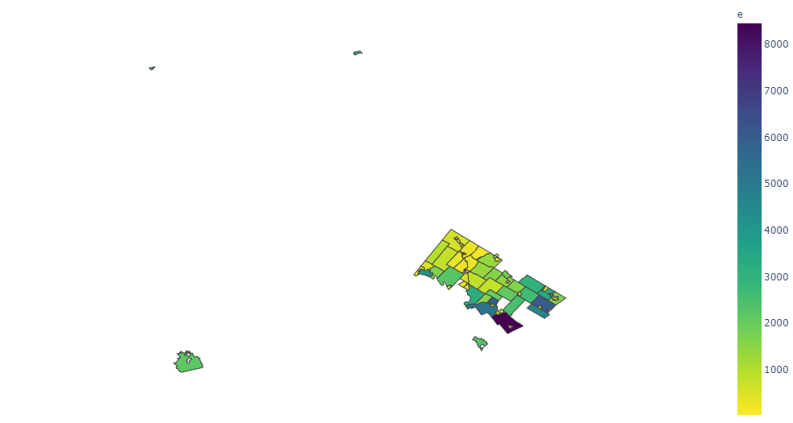
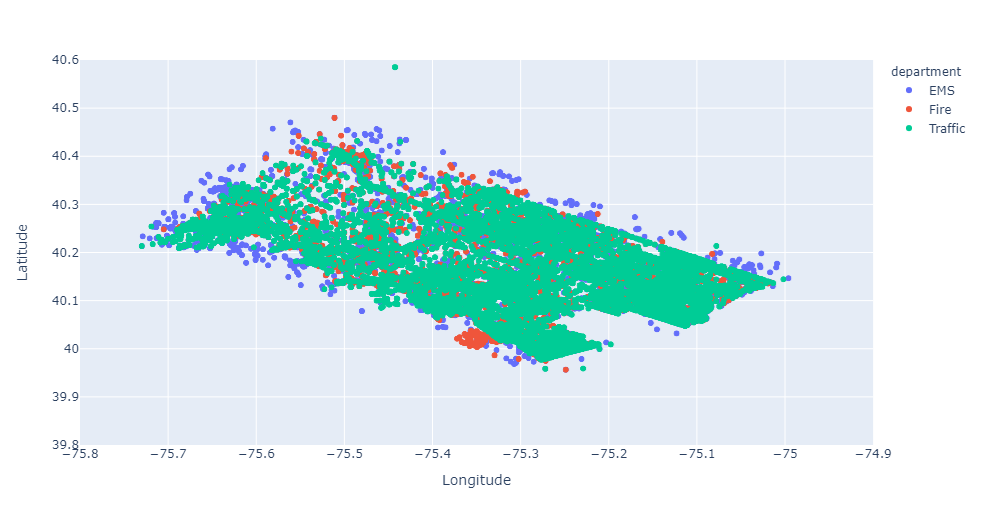

<h1><b>911 Calls</b></h1>

 

<h2>Overview</h2>

Exploring the data of 911 Emergency Calls in Montgomery County, Pennsylvania across three departments: EMS (Emergency Medical Service),  Fire, and Traffic. The data is provided by <a href='http://montcoalert.org/gettingdata/'>montcoalert.org</a>. The codes are split into a few parts especially the geographical plots due to the fact that the size of choropleth using Plotly library has exceeded the recommended size for github (50Mb) and might bypass the limit (100Mb)

<b>Source</b>: <i>https://www.kaggle.com/mchirico/montcoalert</i>

 

 

    

        <i>Picture 1: The Number of 911 Calls in Montgomery Country, Pennsylvania (Choropleth)</i>
    

 

    

        <i>Picture 2: The Number of 911 Calls in Montgomery Country, Pennsylvania (Scatter Plot)</i>
    

 Should the github viewer not work, please view using these links:

-  <a href='https://nbviewer.jupyter.org/github/fawiyogo001/Data-Science-Portfolio-Python/blob/master/911 Calls/911 Calls - Data Cleaning %26 Visualization.ipynb'>Data Cleaning & Visualization.ipynb</a>.
-  <a href='https://nbviewer.jupyter.org/github/fawiyogo001/Data-Science-Portfolio-Python/blob/master/911%20Calls/911%20Calls%20-%20Geographical%20Plotting%201.ipynb'>Geographical Plotting 1</a>
-  <a href='https://nbviewer.jupyter.org/github/fawiyogo001/Data-Science-Portfolio-Python/blob/master/911%20Calls/911%20Calls%20-%20Geographical%20Plotting%202.ipynb'>Geographical Plotting 2</a>

 

<h2>Data Dictionary</h2>

| Variable  | Definition                        | Key                 |
| --------- | --------------------------------- | ------------------- |
| lat       | Latitude                          |                     |
| lng       | Longitude                         |                     |
| desc      | Description of the Emergency Call |                     |
| zip       | Zipcode                           |                     |
| title     | Title                             |                     |
| timeStamp | Time                              | YYYY-MM-DD HH:MM:SS |
| twp       | Township                          |                     |
| addr      | Address                           |                     |
| e         | Dummy Variable                    | Always 1            |

