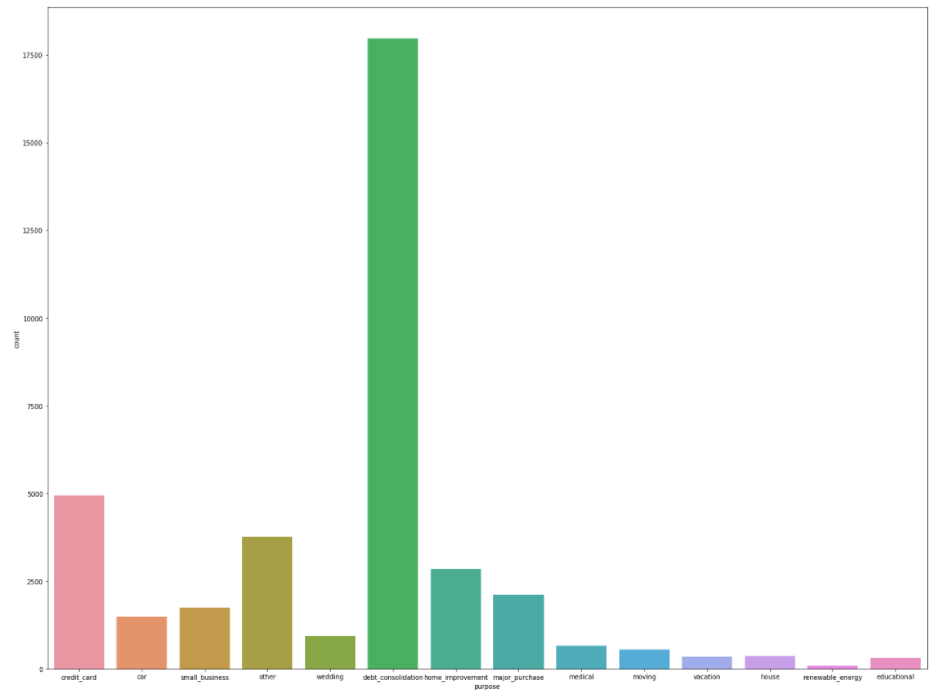

<h1><b>Lending Club Loan</b></h1>

 

<h2>Overview</h2>

This project uses data from an American peer-to-peer lending company, Lending Club, which is knows as one of the more reputable destinations for online personal loans usually for credit card debt consolidation. The data focuses on loans from 2007 to 2011 with up to 116 variables analyzed.

 

 

<i>Picture 1: Borrowers' Purpose in Getting Loan </i>

 

 

\Lending Club Loan\Choropleth.png)

<i>Picture 2: Geographical Plotting of Loan Counts</i>

 

 

<b>Source</b>: <i>https://data.world/jaypeedevlin/lending-club-loan-data-2007-11</i>

 

Should the github viewer not work, please view it <a href='https://nbviewer.jupyter.org/github/fawiyogo001/Data-Science-Portfolio-Python/blob/master/Lending%20Club%20Loan/Lending%20Club%20Loan.ipynb'>here</a>.

 

<h2>Data Dictionary</h2>

The data dictionary can be viewed in this <a href='https://github.com/fawiyogo001/Data-Science-Portfolio-Python/blob/master/Lending%20Club%20Loan/LCDataDictionary.csv'>link</a>.

