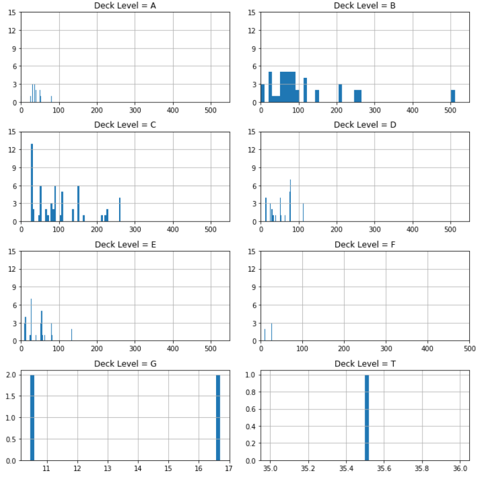
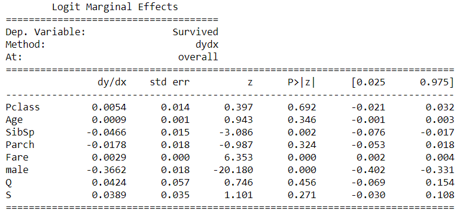
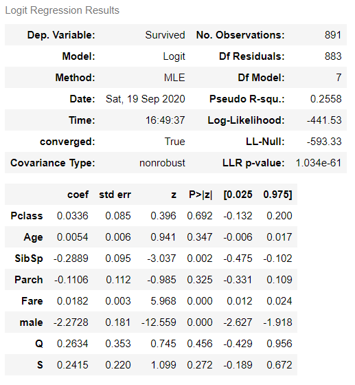

# <b>Titanic Survival Analysis</b>

 

## Overview

This project uses data about Titanic tragedy, which happened on 14 April 1912, to explore the passengers' survival based on the data. 

**Source**: *https://www.kaggle.com/c/titanic/data*

 

<i>Picture 1: The distribution of Titanic passengers based on both ticket fares and Deck Level</i>

 

 

<i>Picture 2: The Model's Logit Marginal Effect</i>

 

 

<i>Picture 3: The Model's Logit Regression Result</i>

 

 

Should the github viewer not work, please view it <a href='https://nbviewer.jupyter.org/github/fawiyogo001/Data-Science-Portfolio-Python/blob/master/Titanic%20Survival%20Analysis/Titanic%20Survival%20Analysis.ipynb'>here</a>.

 

## Data Dictionary

| Variable | Definition                                      | Key                                                         |
| -------- | ----------------------------------------------- | ----------------------------------------------------------- |
| survival | Survival                                        | 0 = No,  1 = Yes                                       |
| pclass   | Ticket Class                                    | 1 = 1st,  2 = 2nd,  3 = 3rd                       |
| sex      | Sex                                             |                                                             |
| Age      | Age in Years                                    |                                                             |
| sibsp    | Number of Siblings / Spouses Aboard the Titanic |                                                             |
| parch    | Number of Parents/ Children Aboard the Titanic  |                                                             |
| ticket   | Ticket Number                                   |                                                             |
| fare     | Passenger Fare                                  |                                                             |
| Cabin    | Cabin Number                                    |                                                             |
| Embarked | Port of Embarkation                             | C = Cherbourg,  Q = Queenstown,   S = Southampton |

 

## Variable Notes

- class: A proxy for socio-economic status (SES)

  1st = Upper/High

  2nd = Middle

  3rd = Lower

- age: Age is fractional if less than 1. If the age is estimated, it is in the form of xx.5

- sibsp: The dataset defines family relations in the following way:

  - Sibling = brother, sister, stepbrother, stepsister
  - Spouse = husband, wife (mistresses and fiancés were ignored)

- parch: The dataset defines family relations in the following way:

  - Parent = mother, father

  - Child = daughter, son, stepdaughter, stepson

    Some children travelled only with a nanny, therefore parch=0 for them.

